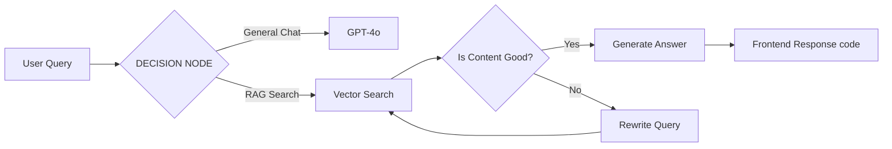

<div align="center">

# 🤖 Agentic RAG Knowledge Assistant

### **Next-Gen AI Research Assistant for Enterprise Knowledge**

[](https://react.dev)
[](https://python.org)
[](https://langchain-ai.github.io/langgraph/)
[](https://openai.com)

<br/>

**I built this project to solve a common problem in RAG systems: Hallucinations.** 
This intelligent agent doesn't just retrieve documents—it evaluates them, re-writes queries if needed, and uses GraphRAG to find hidden connections.

[View Demo](#-demo) • [Tech Stack](#-tech-stack) • [Key Features](#-key-features) • [Installation](#-installation)

</div>

---

## 🎥 Demo

<video src="docs/demo.webp" width="100%" controls style="border-radius: 10px; box-shadow: 0 4px 8px rgba(0,0,0,0.1);"></video>

---

## 🛠 Tech Stack

I chose a modern, scalable stack to build a production-ready application:

- **Frontend:** React, TypeScript, Vite, Tailwind CSS (Custom Dark Mode UI)
- **Backend:** Python, FastAPI (High-performance API)
- **AI Orchestration:** LangChain & LangGraph (Stateful Multi-Agent System)
- **Vector Database:** Pinecone (Semantic Search)
- **Graph Database:** Neo4j (Knowledge Graph/Relationship Mapping)
- **Observability:** Arize Phoenix (Tracing AI decisions in real-time)

---

## 🚀 Key Features

### 1. **Self-Correcting "Agentic" Workflow**
Unlike standard chatbots, this system **thinks before it speaks**.
- **Router:** Decides if you need a document search, a math calculation, or just a chat.
- **Grader:** An AI node that reads retrieved documents and grades them. If they are irrelevant, it rewrites your search query and tries again.
- **Web Fallback:** If the internal knowledge base fails, it automatically searches the web (DuckDuckGo).

### 2. **GraphRAG (Vector + Graph Search)** 
Uses **Neo4j** to connect data points. If you search for "Apple", it understands the relationship to "Steve Jobs" and "iPhone" even if they aren't in the same paragraph.

### 3. **Enterprise-Grade Document Handling**
- **Multi-File Upload:** Drag & drop 10+ PDF resource papers at once.
- **Batch Processing:** Handles large datasets efficiently.
- **Citations:** Every answer includes clickable sources, so you can trust the output.

### 4. **Real-Time Observability**
Includes a "Step Visualization" UI so users can watch the AI "thinking" (Routing → Retrieving → Grading → Generating).

---

## 🏗 Architecture

A high-level look at how the data flows:



---

## ⚡ Installation

Want to run this locally? Follow these 3 simple steps.

### 1. Clone the Repo
```bash
git clone https://github.com/polranirav/agentic-rag-assistant.git
cd agentic-rag-assistant
```

### 2. Setup Environment
Rename `.env.example` to `.env` and add your OpenAI/Pinecone API keys.
```bash
cp .env.example .env
```

### 3. Run with Docker (Optional) or Locally
**Backend:**
```bash
cd backend
pip install -r requirements.txt
python main.py
```

**Frontend:**
```bash
cd frontend
npm install
npm run dev
```

Visit `http://localhost:5173` and start chatting!

---

## 🤝 Contact

Created by **Nirav Polara**.
Feel free to reach out for collaboration or questions!

[](https://linkedin.com/in/niravpolara)
