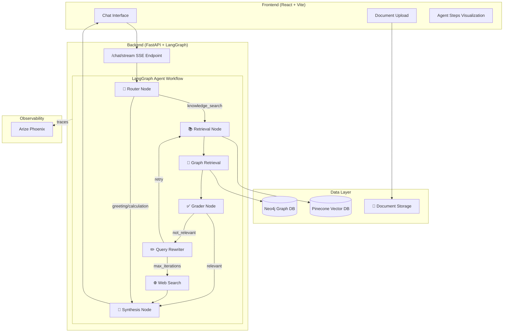

<](https://python.org)
[](https://react.dev)
[](https://langchain-ai.github.io/langgraph/)
[](https://openai.com)
[](https://pinecone.io)
[](https://neo4j.com)

<br/>

**A production-ready RAG system featuring Corrective RAG, GraphRAG, real-time observability, and an intelligent agent workflow that self-corrects when retrieval fails.**

[Features](#-features) • [Architecture](#-architecture) • [Quick Start](#-quick-start) • [Usage](#-usage) • [API](#-api-reference) • [Contributing](#-contributing)

<br/>


</div>

---

## 🎯 Why This Project?

Traditional RAG systems have critical limitations:
- ❌ **Hallucination** when context is insufficient
- ❌ **No self-correction** when retrieval fails
- ❌ **Single-hop retrieval** misses entity relationships
- ❌ **Black-box processing** with no visibility into agent decisions

This project solves all of these with a **state-of-the-art agentic architecture**:

| Problem | Solution |
|---------|----------|
| Hallucination | Confidence scoring + automatic decline when uncertain |
| Failed retrieval | Corrective RAG with query rewriting + web search fallback |
| Missing relationships | Neo4j GraphRAG for entity-aware context enrichment |
| Black-box AI | Real-time agent workflow visualization in UI |

---

## ✨ Features

### 🧠 Intelligent Agent Workflow
- **Intent Classification** — Routes queries to the optimal processing path
- **Semantic Retrieval** — Pinecone vector search with configurable similarity thresholds
- **Document Grading** — LLM-based relevance scoring of retrieved chunks
- **Query Rewriting** — Automatic query transformation when initial retrieval fails
- **Web Search Fallback** — DuckDuckGo integration when knowledge base lacks information
- **Grounded Synthesis** — Strict citation-based response generation

### 📊 GraphRAG Integration
- **Entity Extraction** — Automatic identification of people, organizations, concepts
- **Knowledge Graph** — Neo4j-powered relationship storage and traversal
- **Hybrid Retrieval** — Combines vector similarity with graph-based context enrichment

### 🔍 LLMOps & Observability
- **Arize Phoenix Integration** — Full trace visibility for debugging and optimization
- **Real-time Step Events** — Stream agent decisions to frontend via SSE
- **Latency Tracking** — Per-node timing metrics for performance analysis

### 💻 Modern Developer Experience
- **Multi-file Upload** — Drag & drop multiple PDFs, process in parallel
- **Live Agent Visualization** — Watch Router → Retrieval → Grader → Synthesis in real-time
- **Collapsible Citations** — Source documents with similarity scores
- **Dark Mode UI** — Premium glassmorphism design with smooth animations

---

## 🏗 Architecture



### Corrective RAG Flow

```
┌─────────────────────────────────────────────────────────────────┐
│                     CORRECTIVE RAG PATTERN                       │
├─────────────────────────────────────────────────────────────────┤
│                                                                  │
│   Query ──► Router ──► Retrieval ──► Grader ──┬──► Synthesis    │
│                           ▲                    │                 │
│                           │                    │                 │
│                       Rewriter ◄───────────────┘                │
│                           │         (if not relevant)           │
│                           ▼                                      │
│                      Web Search (after max retries)              │
│                                                                  │
└─────────────────────────────────────────────────────────────────┘
```

---

## 🚀 Quick Start

### Prerequisites

- Python 3.9+
- Node.js 18+
- Docker (for Neo4j)
- OpenAI API Key
- Pinecone API Key

### 1. Clone & Setup

```bash
git clone https://github.com/yourusername/agentic-rag-assistant.git
cd agentic-rag-assistant
```

### 2. Configure Environment

```bash
cp .env.example .env
```

Edit `.env` with your API keys:

```env
# Required
OPENAI_API_KEY=sk-...
PINECONE_API_KEY=...
PINECONE_INDEX_NAME=rag-knowledge-base
PINECONE_ENVIRONMENT=us-east-1

# Optional (for GraphRAG)
NEO4J_URI=bolt://localhost:7687
NEO4J_USER=neo4j
NEO4J_PASSWORD=password123
```

### 3. Start Backend

```bash
cd backend
python -m venv venv
source venv/bin/activate  # Windows: venv\Scripts\activate
pip install -r ../requirements.txt

# Run the server
PYTHONPATH=. uvicorn main:app --host 0.0.0.0 --port 8000 --reload
```

### 4. Start Frontend

```bash
cd frontend
npm install
npm run dev
```

### 5. (Optional) Start Neo4j

```bash
docker-compose up neo4j -d
```

### 6. Access the Application

| Service | URL |
|---------|-----|
| Frontend | http://localhost:5173 |
| Backend API | http://localhost:8000 |
| API Docs | http://localhost:8000/docs |
| Neo4j Browser | http://localhost:7474 |

---

## 📖 Usage

### Uploading Documents

1. Navigate to the **Documents** tab
2. Click **"Choose Files to Upload"** (supports multiple files)
3. Select PDFs, TXT, MD, DOCX, CSV, or JSON files
4. Click **"Ingest All Documents"** to process into vector store

Supported formats:
- 📄 PDF (research papers, reports)
- 📝 TXT, MD (plain text, markdown)
- 📊 CSV, JSON (structured data)
- 📃 DOCX (Word documents)

### Asking Questions

Switch to the **Chat** tab and ask questions about your documents:

```
"Summarize the key findings from the uploaded research papers"
"What methodology was used in the machine learning study?"
"Compare the approaches discussed in the AI papers"
```

### Agent Workflow Visualization

Watch the agent's decision-making process in real-time:

| Step | Description |
|------|-------------|
| 🎯 **Router** | Classifies intent (knowledge_search, calculation, greeting) |
| 📚 **Retrieval** | Searches Pinecone for relevant document chunks |
| 🔗 **Graph Retrieval** | Enriches context with Neo4j entity relationships |
| ✅ **Grader** | Evaluates if retrieved documents answer the question |
| ✏️ **Rewriter** | Transforms query if documents weren't relevant |
| 🌐 **Web Search** | Falls back to DuckDuckGo if KB lacks information |
| 💬 **Synthesis** | Generates grounded response with citations |

---

## 📡 API Reference

### Chat Endpoint (SSE Stream)

```http
POST /chat/stream
Content-Type: application/json

{
  "query": "What are the main findings?",
  "session_id": "optional-session-id"
}
```

**Response**: Server-Sent Events stream with:
- `step` events (agent workflow progress)
- `token` events (streaming response)
- `citation` events (source documents)
- `done` event (completion signal)

### Document Management

| Endpoint | Method | Description |
|----------|--------|-------------|
| `/api/upload/` | POST | Upload a document |
| `/api/upload/documents` | GET | List all documents |
| `/api/upload/documents/{filename}` | DELETE | Delete a document |
| `/api/upload/ingest` | POST | Process documents into vector store |

### Health Check

```http
GET /health
```

---

## ⚙️ Configuration

### Backend Settings (`core/config.py`)

| Setting | Default | Description |
|---------|---------|-------------|
| `OPENAI_MODEL` | `gpt-4o-mini` | LLM for routing/synthesis |
| `OPENAI_EMBEDDING_MODEL` | `text-embedding-3-small` | Embedding model |
| `SIMILARITY_THRESHOLD` | `0.5` | Minimum similarity for retrieval |
| `RETRIEVAL_K` | `5` | Number of chunks to retrieve |
| `CHUNK_SIZE` | `1500` | Document chunk size |
| `CHUNK_OVERLAP` | `300` | Overlap between chunks |
| `MAX_ITERATIONS` | `3` | Max Corrective RAG retries |

### Frontend Environment

```env
VITE_API_URL=http://localhost:8000
```

---

## 🧪 Testing

### Run Backend Tests

```bash
cd backend
pytest tests/ -v
```

### Test RAG Pipeline

```bash
# Ingest sample documents
python scripts/ingest.py

# Test query
curl -X POST http://localhost:8000/chat/stream \
  -H "Content-Type: application/json" \
  -d '{"query": "Summarize the documents"}'
```

---

## 📁 Project Structure

```
agentic-rag-assistant/
├── backend/
│   ├── agents/
│   │   ├── graph.py           # LangGraph workflow definition
│   │   ├── nodes.py           # Router, Retrieval, Synthesis nodes
│   │   ├── grader_node.py     # Document relevance grading
│   │   ├── web_search_node.py # DuckDuckGo fallback
│   │   ├── graph_retrieval_node.py # Neo4j hybrid retrieval
│   │   └── state.py           # AgentState TypedDict
│   ├── api/
│   │   └── upload.py          # Document upload endpoints
│   ├── core/
│   │   ├── config.py          # Settings management
│   │   ├── graph_store.py     # Neo4j connection manager
│   │   └── tracing.py         # Arize Phoenix instrumentation
│   ├── scripts/
│   │   └── ingest.py          # Document ingestion pipeline
│   └── main.py                # FastAPI application
├── frontend/
│   ├── src/
│   │   ├── components/
│   │   │   ├── ChatInterface.tsx  # Main chat UI
│   │   │   ├── AgentSteps.tsx     # Workflow visualization
│   │   │   └── DocumentUpload.tsx # File management
│   │   └── App.tsx
│   └── package.json
├── data/
│   └── raw/                   # Uploaded documents
├── docker-compose.yml         # Neo4j service
├── requirements.txt           # Python dependencies
└── README.md
```

---

## 🛠 Tech Stack

| Layer | Technology |
|-------|------------|
| **LLM Framework** | LangChain + LangGraph |
| **Vector Database** | Pinecone |
| **Graph Database** | Neo4j |
| **Backend** | FastAPI + Python 3.9+ |
| **Frontend** | React 18 + TypeScript + Vite |
| **Embeddings** | OpenAI text-embedding-3-small |
| **LLM** | OpenAI GPT-4o-mini |
| **Observability** | Arize Phoenix |
| **Web Search** | DuckDuckGo |

---

## 🤝 Contributing

Contributions are welcome! Please read our contributing guidelines:

1. Fork the repository
2. Create a feature branch (`git checkout -b feature/amazing-feature`)
3. Commit your changes (`git commit -m 'Add amazing feature'`)
4. Push to the branch (`git push origin feature/amazing-feature`)
5. Open a Pull Request

---

## 📄 License

This project is licensed under the MIT License - see the [LICENSE](LICENSE) file for details.

---

## 🙏 Acknowledgments

- [LangChain](https://langchain.com) & [LangGraph](https://langchain-ai.github.io/langgraph/) for the agent framework
- [Pinecone](https://pinecone.io) for vector search
- [Neo4j](https://neo4j.com) for graph database
- [Arize Phoenix](https://phoenix.arize.com) for observability
- [OpenAI](https://openai.com) for LLM and embeddings

---

<div align="center">

**Built with ❤️ for the AI community**

⭐ Star this repo if you found it helpful!

</div>
]]>
